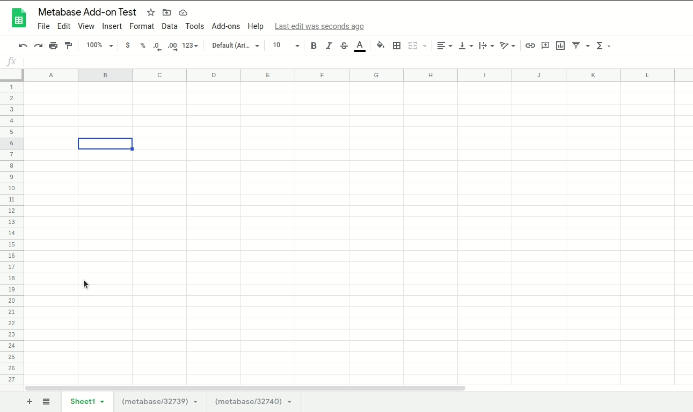

# Metabase Google Sheets Add-on

This Google Sheets add-on imports the result of a Metabase question to a Google Sheet by using the [Metabase API](https://github.com/metabase/metabase/blob/master/docs/api-documentation.md).

It has two main functions that an user can access:

- `importQuestion`: import a single question from Metabase using it's question id number (you can find this at the end of a question URL) into the current Google Sheet tab
- `importAllQuestions`: imports all questions in a Google Sheet using the following name convention: `(metabase/123)` -> imports question number 123

## What Users See

## Metabase API Access

Currently, the add-on authenticates with Metabase by using a user account. You can use your own user account or create a dedicated one for the add-on. It sends the username and password and [gets a token](https://github.com/metabase/metabase/wiki/Using-the-REST-API#authorizing) in response that it uses to make requests. If the token is expired (after a certain period of time it will expire) then the script requests a new token.

When deploying for the first time, remember to set following ENV vars in your Google Script Project file, by going to File -> Project Properties:
  - `BASE_URL` (the url to your metabase instance with a trailing slash, e.g. `https://my-company.metabase.com/`)
  - `USERNAME` (a Metabase username)
  - `PASSWORD` (a Metabase user password)
  - `TOKEN` (do not set it; it will be set automatically)

## Publishing the Add-on

Publishing a Google Apps Add-on is a tricky process. For help on how to publish a Google Sheets Add-on: https://developers.google.com/gsuite/add-ons/how-tos/publishing-editor-addons.

Otherwise, you can just use the code as a simple Google Apps Script.
